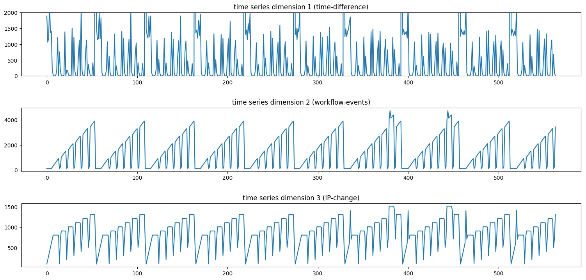
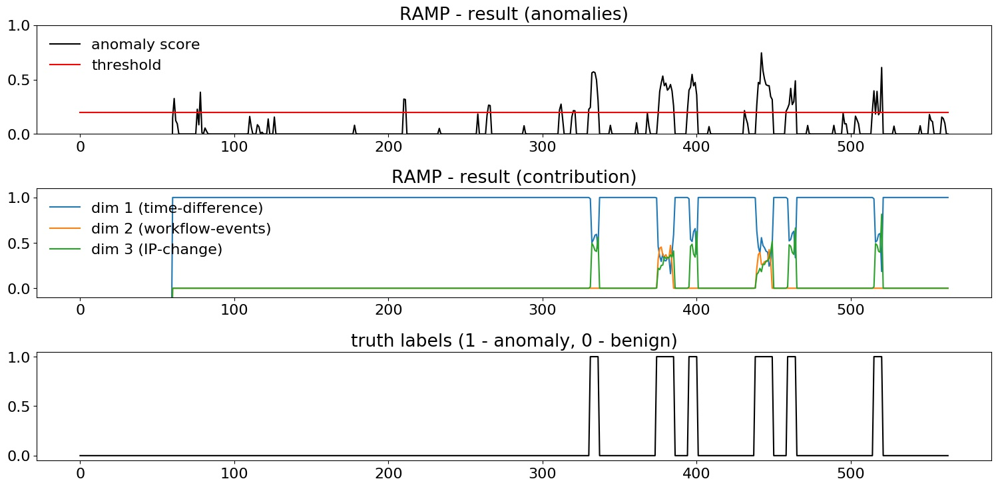

# RAMP : Real-Time Aggregated Matrix Profile

This repository includes a python implementation of RAMP, a machine learning model originally developed for real-time anomaly detection in scientific workflows. Please refer the [paper](http://www.dinalherath.com/papers/2019RAMP_extended_paper.pdf) for details on algorithms. The code includes an illustrative example for a non-interleaved scientific workflow dataset, generated from [DATAVIEW](https://github.com/shiyonglu/DATAVIEW) workflow management system with synthetic anomalies of two types. The system logs were parsed into a multidimensional time series with three dimensions as shown in image below (__the first three subfigures__). 

Comparing the truth labels (__final subfigure__) with the RAMP result for the anomaly scores clearly shows RAMP identifies all the anomaly instances, where the peaks greater than the threshold indicate anomalies. Additionally, RAMP is able to identify what features may have contributed to the anomaly instance (__figure before last__) where the two anomaly types can be clearly distuingished. Anomaly type-1 only causes changes in dimensions 1 & 3 (blue and green), where as anomaly type-2 causes changes in all three feature dimensions. Executing the code _run_ramp.py_ will generate and save the figures for the example dataset.




**requirements:** python3, numpy

```
@inproceedings{herath2019ramp,
  title={RAMP: Real-Time Anomaly Detection in Scientific Workflows},
  author={Herath, J Dinal and Bai, Changxin and Yan, Guanhua and Yang, Ping and Lu, Shiyong},
  booktitle={2019 IEEE International Conference on Big Data (Big Data)},
  pages={1367--1374},
  year={2019},
  organization={IEEE}
}
```


